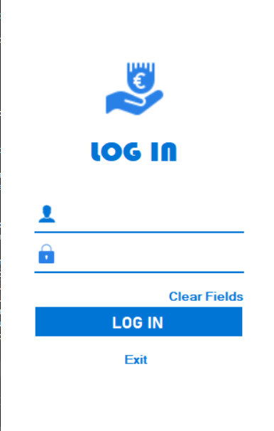
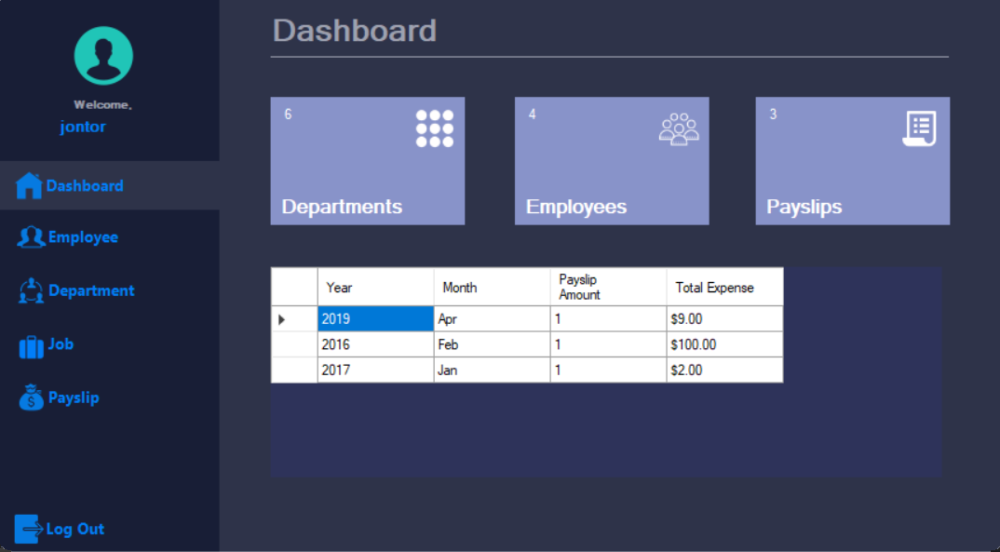
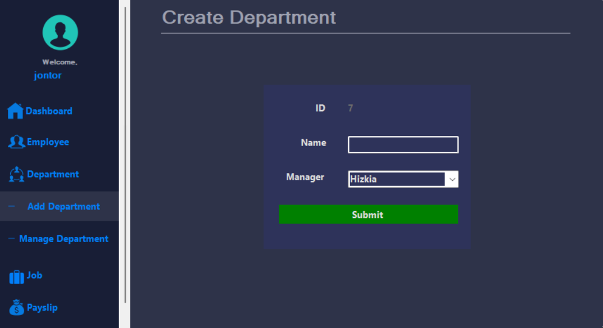
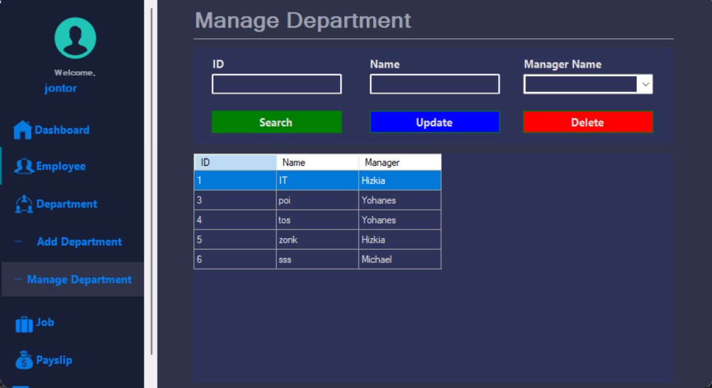
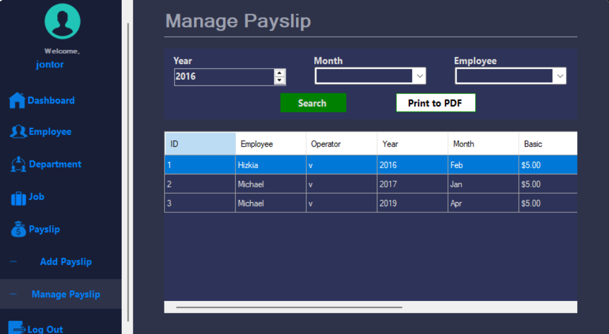
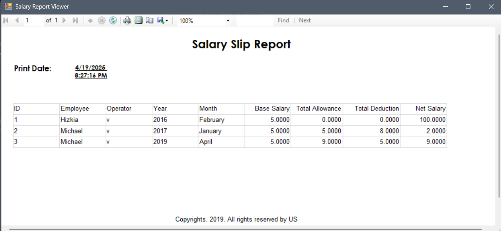

# 💼 Salary Slip Application

This is our very first **group project** involving 4 people, including myself.  
We developed a **Salary Slip Generator App** using **C#**, designed to generate and print employee salary slips.

---

## 👥 Team

- Group of 4 people (including me)
- Our first experience working together on a real software project

---

## 🛠️ Tech Stack

- **Language:** C#  
- **Framework:** .NET (Windows Forms App)  
- **IDE:** Visual Studio 2022  
- **Database Access:** LINQ  
- **Reporting:** ReportViewer for generating printable salary slips

---

## 💡 Features

- 🧾 Generate salary slips for employees  
- 🗂 Store and retrieve employee data  
- 🖨 Print out salary details using ReportViewer  
- 🧠 Learn and apply LINQ for database access  
- 🧪 Simple validation and UI interactions

---

## 🚀 How to Run

1. Open the project in **Visual Studio 2022**
2. Restore any missing NuGet packages if prompted
3. Ensure your database connection is properly set in `App.config` or in your LINQ-to-SQL setup
4. Build and run the project
5. Use the form to input employee data and generate salary slips
6. Don't forget to change the properties setting's string of database .mdf file location

---

## 🧠 What We Learned

- Collaborating in a small development team  
- Designing and implementing a simple Windows Forms UI  
- Connecting to a database with LINQ  
- Using ReportViewer to generate structured, printable documents  
- Managing basic form events and logic in C#

---

## 📝 Notes

- This project helped us build a strong foundation in C# and WinForms development  
- It was our first experience dealing with reports and printing through an app interface  
- There might still be areas for improvement, but we’re proud of the outcome as our first group project!

---

## 📸 Screenshot / Preview

